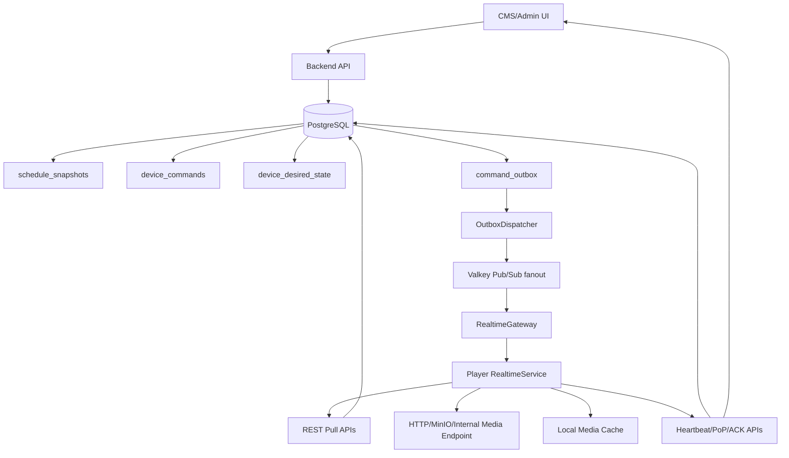
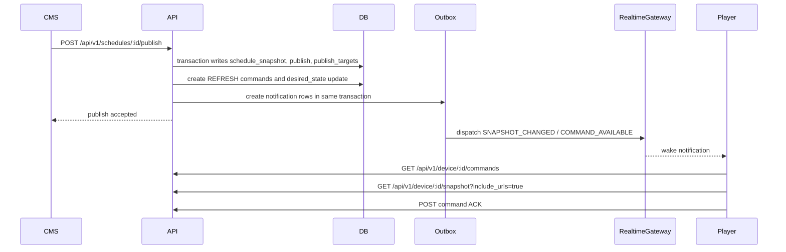
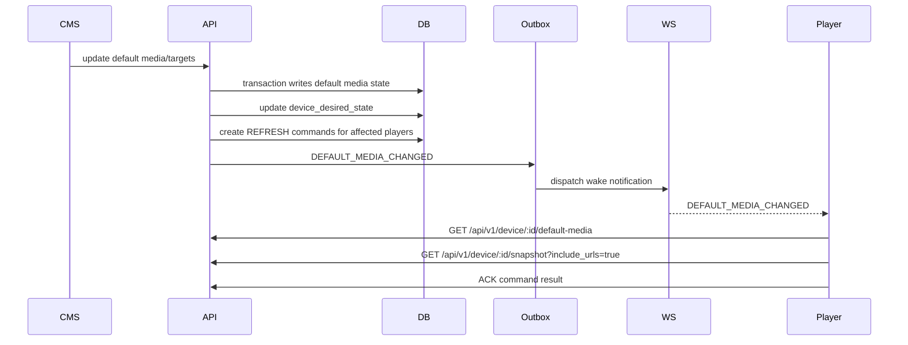
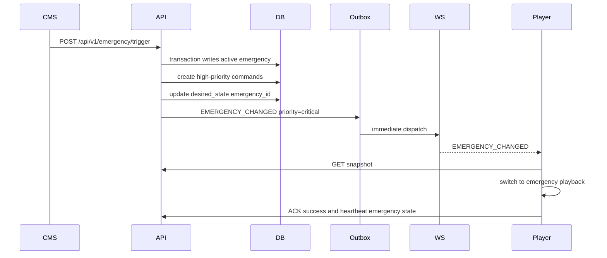
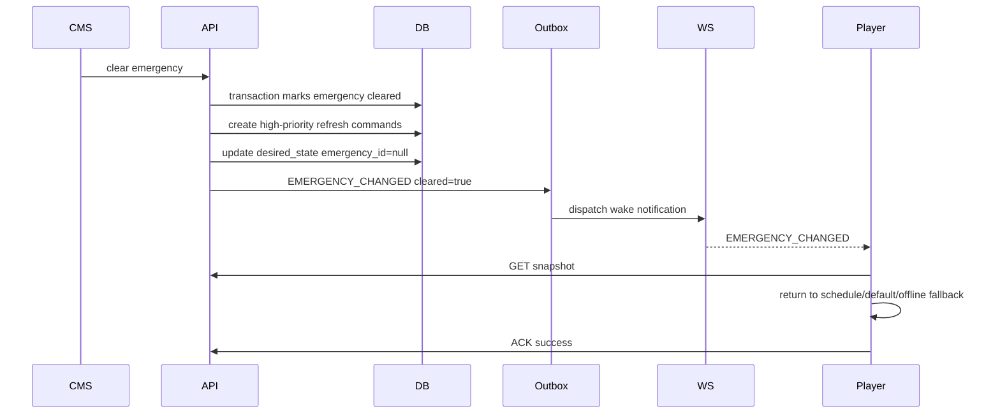
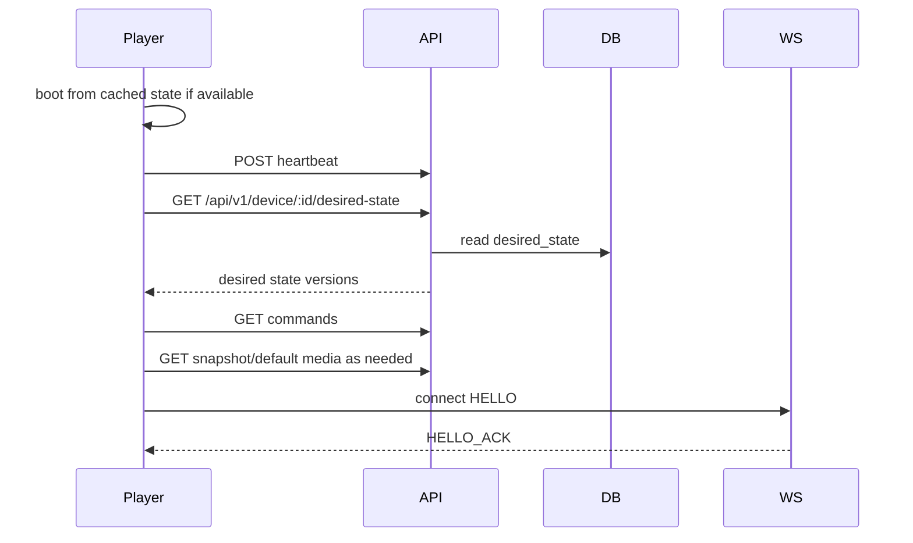
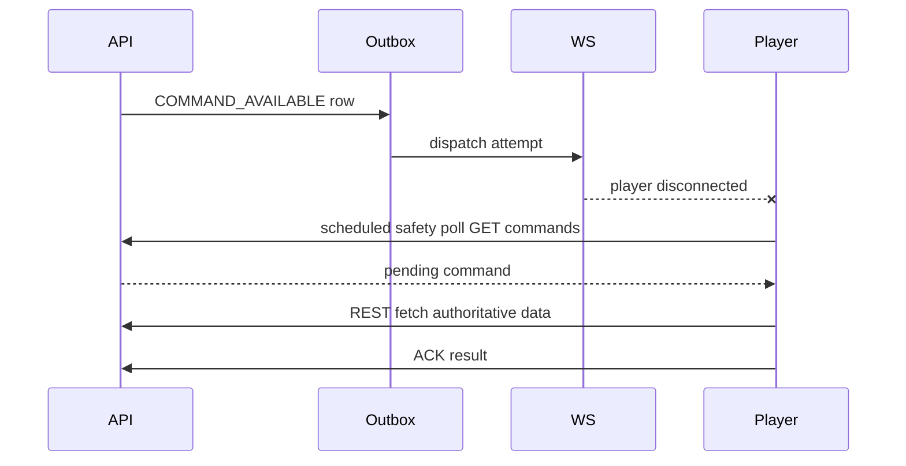

# Enterprise Realtime Sync Architecture

Last updated: 2026-05-25
Updated by: Codex
Status: Phase 8 Valkey fanout backfill implemented locally; on-prem runtime evidence blocked

## Purpose

This document defines the target enterprise realtime sync architecture for DARSHAN signage players and CMS operations.

The selected architecture is hybrid:

- database tables and published snapshots are the source of truth
- `device_commands` remains the durable command queue
- WebSocket is notification and wake-up only
- players fetch authoritative state through REST APIs
- media files are delivered by HTTP/on-prem object storage/MinIO/internal media endpoints/local cache
- polling and heartbeat remain mandatory fallback paths
- transactional outbox bridges DB commits to realtime notifications
- device desired state lets players reconcile missed events
- the same backend contract must support Electron, Android TV, Android, iOS/iPadOS, tvOS, and future signage players
- all dev, QA, and production deployments are air-gapped on-prem/internal networks unless explicitly documented otherwise
- Valkey-backed fanout is required before multi-instance production realtime; sticky-session-only is not approved

## Phase 6 Verification Guardrail

Phase 6 implemented media/cache failure reporting and per-screen CMS visibility only. It added an additive `media_cache_reports` table, device REST report endpoint, CMS REST listing endpoint, Electron cache failure reporter, and Delivery tab failure card. It did not implement deployment hardening, mobile work, log/screenshot result visibility, production dashboards, Electron realtime changes, or any WebSocket source-of-truth behavior.

Current approval state: `APPROVED_WITH_CONDITIONS`.

Phase 7 may start only after accepting Phase 6 conditions. QA/prod realtime enablement must not start until:

- player/backend/CMS build/tests are rerun under Node `>=20 <21` before on-prem QA signoff
- packaged Electron-to-backend realtime smoke is run against the Phase 3 gateway
- on-prem QA WebSocket proxy behavior and Valkey fanout are reviewed
- dedicated realtime/outbox/media-cache metrics are validated under QA traffic before production enablement
- CMS Delivery tab visual/E2E review is completed or explicitly deferred
- CMS lint is rerun under Node 20
- `media_cache_reports` retention/partitioning is decided
- public cloud push, public CDN, or public endpoint dependencies are not assumed
- the phase approval log is updated

## Current Architecture

Confirmed from repo audit:

- Backend publishes schedules into DB-backed snapshots through `darshan-server/src/routes/schedule-publish-helper.ts`.
- Device runtime snapshots are fetched through `darshan-server/src/routes/device-telemetry.ts` at `GET /api/v1/device/:deviceId/snapshot`.
- Default media is fetched through `GET /api/v1/device/:deviceId/default-media`.
- Durable commands are stored in `device_commands` in `darshan-server/src/db/schema.ts`.
- Electron claims commands through heartbeat and `GET /api/v1/device/:deviceId/commands`.
- Electron acknowledges commands through `POST /api/v1/device/:deviceId/commands/:commandId/ack`.
- Electron caches media locally through `darshan-player/src/main/services/cache/cache-manager.ts`.
- Existing Socket.IO infrastructure now includes an isolated `/device` namespace for production player wake-up notifications when `REALTIME_SYNC_ENABLED=true`.
- Backend realtime fanout now supports a Valkey Pub/Sub-backed node bus and short-lived device-to-node mapping for on-prem multi-instance wake notification routing when `REALTIME_BUS_PROVIDER=valkey`.
- Electron now includes a feature-flagged RealtimeService that consumes `/device` wake notifications when `DARSHAN_REALTIME_PLAYER_ENABLED=true`.
- CMS screen details now includes a feature-flagged Delivery tab backed by `GET /api/v1/screens/:id/delivery-status`.
- Existing nginx config proxies `/socket.io/`.

Current runtime flow:

```text
CMS action
  -> backend DB write
  -> schedule snapshot/default media/emergency/device command state
  -> Electron heartbeat or command polling
  -> Electron REST fetches snapshot/default/emergency
  -> Electron downloads media over HTTP and local cache
  -> Electron renders emergency, schedule layout/media, default, offline, or empty state
  -> Electron sends ACK, heartbeat, PoP, screenshot/status
```

## Target Architecture

```text
CMS/API transaction
  -> DB source of truth
       - schedule_snapshots
       - publishes
       - default media state
       - emergencies
       - device_commands
       - device_desired_state
       - command_outbox
  -> OutboxDispatcher
  -> RealtimeGateway notification only
  -> Player wakes
  -> Player REST pulls authoritative data
  -> Player caches media over HTTP/CDN
  -> Player ACKs commands and reports telemetry
```

## Why Not Pure WebSocket

Pure WebSocket is not appropriate for this system because:

- signage payloads can be large and should not ride a realtime control channel
- players can be offline for minutes or days
- mobile platforms may suspend background WebSockets
- commands need auditability, retries, expiry, and failure status
- schedule snapshots must remain reproducible and fetchable after reconnect
- WebSocket gateways may restart or scale independently from API workers
- high-fleet fanout needs backpressure and durable dispatch tracking

## Why Hybrid WebSocket + REST + DB Queue

Hybrid sync separates responsibility:

- DB stores truth and history.
- REST returns canonical state.
- `device_commands` guarantees delivery intent and ACK visibility.
- WebSocket reduces latency when connected.
- Polling/heartbeat guarantees eventual catch-up when WebSocket is unavailable.
- Outbox guarantees notifications are not lost between DB commit and realtime dispatch.

## Component Diagram



## Sequence Diagrams

### Schedule Publish



### Default Media Update



### Emergency Start



### Emergency Clear



### Player Reconnect After Offline



### WebSocket Missed But Polling Fallback Catches



## Backend Components

### RealtimeGateway

Owns the device realtime endpoint. It sends notification-only messages and never sends media or authoritative snapshots.

Implemented location: `darshan-server/src/realtime/device-gateway.ts`.

Phase 3 implementation:

- Socket.IO namespace: `/device` by default through `REALTIME_DEVICE_NAMESPACE`.
- Startup flag: `REALTIME_SYNC_ENABLED`.
- Auth: validates device id plus existing device certificate serial credentials.
- Messages handled: `HELLO`, `PING`.
- Messages emitted: `HELLO_ACK`, `PONG`, `COMMAND_AVAILABLE`, `RESYNC_REQUIRED`, `ERROR`.

### DeviceConnectionRegistry

Tracks connected device sessions, protocol version, app version, last ping, and disconnect reason. It is for observability and best-effort local routing only.

Implemented location: `darshan-server/src/realtime/device-connection-registry.ts`.

The socket registry remains local in-memory state. Phase 8 backfill adds Valkey-backed fanout/distributed coordination through `darshan-server/src/realtime/realtime-fanout.ts`, `darshan-server/src/realtime/realtime-bus.ts`, and `darshan-server/src/realtime/device-node-registry.ts`. Local unit and Docker Valkey integration tests pass, but on-prem node A/node B fanout and outage fallback evidence are still required before production readiness.

### On-Prem Multi-Instance Fanout

Required behavior:

- API node writes DB source-of-truth rows and `command_outbox`.
- Outbox dispatcher publishes a small wake event through Valkey Pub/Sub.
- Gateway node that owns the player socket emits `COMMAND_AVAILABLE` or `RESYNC_REQUIRED`.
- Player fetches authoritative commands/state/snapshots/default/emergency through REST.
- If Valkey is unavailable, DB outbox remains durable and polling/heartbeat fallback still catches commands.
- Media and full snapshots never go over Valkey.

Valkey Streams may be considered later only if broker-side persisted fanout is required; the DB outbox remains the durability layer.

### CommandNotifier

Creates notification intent for command availability, snapshot changes, default media changes, emergency changes, and desired-state changes.

### CommandOutbox

Transactional table written in the same DB transaction as command/state changes.

### OutboxDispatcher

Worker that reads pending outbox rows, dispatches realtime notifications, retries failures, and records dispatch status.

Implemented location: `darshan-server/src/services/outbox-dispatcher.ts`.

Phase 3 behavior:

- Reads from `command_outbox`.
- Atomically claims rows by setting `status='DISPATCHING'`.
- Emits notification-only payloads.
- Marks rows `DISPATCHED` when at least one active connection receives the notification.
- Returns rows to `PENDING` when the target device is disconnected.
- Reclaims stale `DISPATCHING` rows after `OUTBOX_DISPATCH_LEASE_MS`.

### DeviceDesiredState

Materialized desired state per screen:

- current snapshot/publish
- current emergency
- default media version/hash
- command sequence/version
- updated timestamp

### CommandLifecycleService

Central service for command creation, lease, reclaim, processing, ACK success/failure, expiry, dead-letter, cancellation, and status history.

## Electron Components

### RealtimeService

Connects after authenticated runtime bootstrap. Handles HELLO, HELLO_ACK, reconnect/backoff, pings, and wake messages.

Implemented location: `darshan-player/src/main/services/realtime-service.ts`.

Phase 4 behavior:

- Connects to the backend `/device` Socket.IO namespace when `DARSHAN_REALTIME_PLAYER_ENABLED=true`.
- Sends platform-neutral `HELLO` and waits for `HELLO_ACK` before marking realtime healthy.
- Treats `COMMAND_AVAILABLE` and `RESYNC_REQUIRED` as wake notifications only.
- Fetches desired state and commands through REST.
- Rejects WebSocket payloads containing snapshot or media data.
- Uses existing polling/heartbeat fallback when disabled or disconnected.

### Adaptive Polling

Implemented location: `darshan-player/src/main/services/command-processor.ts`.

When realtime is healthy, command polling uses the configured safety interval. When realtime is unhealthy, disabled, or disconnected, the existing fallback polling interval is used. Heartbeat remains active in both states.

When WebSocket is healthy:

- command poll changes to safety interval
- snapshot/default poll changes to slow reconciliation interval

When WebSocket is unhealthy:

- command poll returns to fallback interval
- heartbeat remains active
- snapshot/default polling remains safe fallback

### Command Idempotency

Commands must be processed once per command id plus delivery token. Duplicate notifications may trigger extra fetches but must not cause duplicate side effects.

### ACK Retry

ACKs must be queued locally if HTTP fails and retried until accepted or command expires.

### Desired State Reconciliation

Player periodically calls desired-state REST API and compares server versions with local versions. If stale, it fetches commands, snapshot, default media, or emergency state.

## CMS Components

### Command Status UI

Show per-screen command history, latest command state, attempts, last error, and ACK result.

### Publish Delivery Status

Show publish target delivery using `publish_targets`, command state, desired-state version, and last heartbeat.

### Emergency Delivery Status

Show emergency target delivery, active/cleared state, command ACKs, and player heartbeat mode.

### Media/Cache Failure Visibility

Phase 6 implements per-screen media cache failures, URL expiry errors, download failures, disk-full/cache write reports, and CMS status visibility through REST. Full signed URLs are sanitized to host plus path hash. Phase 8 local continuation added media/cache metrics and alert rules; production dashboard tuning and retention approval remain open.

## Deployment Requirements

- Backend API and WebSocket gateway must share auth and device identity rules.
- `/socket.io/` or the selected raw WebSocket path must be proxied with upgrade headers.
- API nodes must share realtime routing through Valkey-backed fanout if horizontally scaled.
- Sticky sessions are optional only when Socket.IO HTTP polling transport is enabled.
- Prefer validated WebSocket-only transport for device realtime on on-prem networks.
- Outbox dispatcher must run as a worker role.
- DB indexes must support command lease, expiry, outbox dispatch, and desired-state reads.
- Metrics must include active connections, notification dispatch latency, outbox lag, command lifecycle counters, ACK latency, fallback polling rate, and reconnect storms.
- Phase 7 deployment hardening assets are documented in `docs/runbooks/realtime-sync-qa-prod-hardening.md`.
- QA and production environment checklists live in `docs/environments/qa/realtime-sync.env.example` and `docs/environments/production/realtime-sync.env.example`.
- The explicit REST plus notification-only Socket.IO proxy snippet lives in `deploy/shared/realtime-sync-nginx.socketio.conf.template`.

## QA/Prod Rollout Plan

1. Ship docs and status tracking.
2. Add additive DB migrations with feature flags disabled.
3. Enable command lifecycle service in compatibility mode.
4. Enable outbox writes without dispatch.
5. Enable dispatcher in QA.
6. Enable device realtime in QA for test players.
7. Enable adaptive polling in QA.
8. Complete Phase 7 on-prem QA proxy/canary rollback validation.
9. Run Phase 8 E2E, load, and chaos tests.
10. Roll out production to a canary player group.
11. Expand by fleet group while monitoring fallback rate, ACK latency, outbox lag, and emergency latency.

## Rollback Plan

- Disable `REALTIME_SYNC_ENABLED`.
- Keep REST polling and heartbeat fallback active.
- Stop OutboxDispatcher if it causes load.
- Leave additive DB columns/tables in place.
- Continue serving snapshots/default/emergency through existing REST APIs.
- Revert player config to polling intervals if adaptive polling causes regressions.
